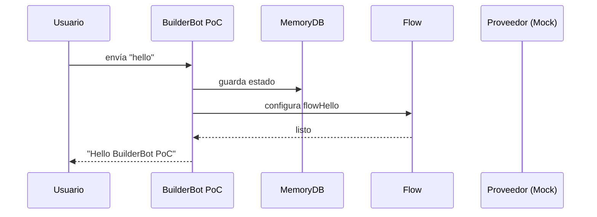

'use strict';

Migración bot-whatsapp a builderbot — Diagramas Mermaid (PoC)

Este documento proporciona un gemelo en Markdown con diagramas de flujo y de secuencia (Mermaid) para validar una migración inicial a BuilderBot.

Diagrama de flujo (flowchart)

```mermaid
flowchart TD
  A[Iniciar PoC BuilderBot] --> B{MemoryDB disponible}
  B -->|Sí| C[Crear flowHello: addKeyword('hello').addAnswer('Hello BuilderBot PoC')]
  C --> D[Crear Flow con createFlow([flowHello])]
  D --> E[Crear MemoryDB]
  E --> F[Iniciar Bot con createBot({ flow, provider, database })]
  F --> G[Proveedor Mock: initHttpServer]
  G --> H[PoC listo]
```

Diagrama de secuencia



Notas prácticas

- Este PoC asume que BuilderBot expose memory DB y API de flow de forma similar a bot-whatsapp.
- El mock provider implementa initHttpServer para simular un servidor API.
- Este diagrama no representa código real; es una guía de alto nivel para validar integraciones.

Cómo usar

- Ejecutar el PoC si se tiene el archivo src/builderbot_poc.js: node src/builderbot_poc.js

Fuente de referencia

- Plan para migración y su ampliación en fases.

Fin