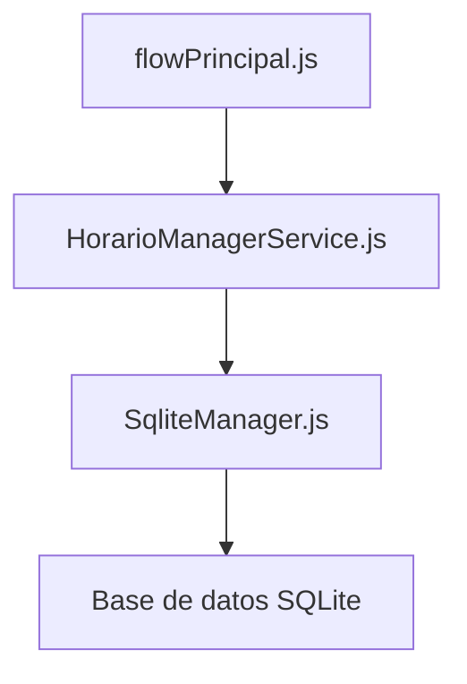

# Documentación del Módulo de Horarios

Este documento describe el funcionamiento del módulo de horarios, desde la lógica de alto nivel en los flujos de conversación hasta la implementación en la base de datos.

## 1. Visión General

El módulo de horarios permite a los bots operar o permanecer inactivos según un cronograma predefinido. Esto es útil para:

-   Responder automáticamente a los usuarios solo durante el horario comercial.
-   Pausar las respuestas automáticas durante los días festivos o eventos especiales.
-   Gestionar ventanas de tiempo para el envío de campañas de marketing.

## 2. Flujo de la Lógica

El proceso de verificación de horarios se inicia en el flujo principal de conversación y atraviesa varias capas de la aplicación:



### 2.1. `flowPrincipal.js`

El punto de entrada para la lógica de horarios es el archivo `src/flows/flowPrincipal.js`. En este archivo, se instancia el `HorarioManagerService` y se invoca el método `verificarHorarioBot` para determinar si el bot debe procesar el mensaje entrante.

**Ejemplo de código:**

```javascript
const HorarioManagerService = require("../services/HorarioManagerService");

const flowPrincipal = addKeyword(EVENTS.WELCOME).addAction(
  async (ctx, { flowDynamic, provider }) => {
    const horarioService = new HorarioManagerService();
    const isAutoTime = await horarioService.verificarHorarioBot(1, botName , new Date());

    if (isAutoTime) {
      // Procesar el mensaje
    } else {
      // Ignorar el mensaje o enviar una respuesta de "fuera de horario"
    }
  }
);
```

### 2.2. `HorarioManagerService.js`

Este servicio, ubicado en `src/services/HorarioManagerService.js`, actúa como una capa de abstracción entre la lógica de la aplicación y la base de datos. Proporciona métodos para crear, obtener y verificar horarios.

**Métodos clave:**

-   `verificarHorarioBot(tipo_horario_id, botId, fechaHora)`: Verifica si un bot está dentro de su horario de atención. Este método llama a `verificarDisponibilidad` en el `SqliteManager`.
-   `crearHorarioBot(botName, configuracion)`: Crea un nuevo horario para un bot, junto con sus reglas y excepciones.
-   `obtenerHorario(schedulableType, schedulableId)`: Obtiene la configuración completa de un horario.

### 2.3. `SqliteManager.js`

El `SqliteManager`, en `src/database/SqliteManager.js`, es responsable de la interacción directa con la base de datos SQLite. Define los modelos de Sequelize para las tablas de horarios y contiene la lógica para consultar y manipular los datos.

**Métodos clave:**

-   `verificarDisponibilidad(tipo_horario_id, botName, fechaHora)`: Esta es la función principal que determina si un bot está disponible. Comprueba primero las excepciones para la fecha actual y, si no hay ninguna, evalúa las reglas de horario para el día y la hora actuales.
-   `obtenerHorarioCompleto(tipo_horario_id, bot_name)`: Recupera un horario junto con todas sus reglas y excepciones asociadas.
-   `crearHorario`, `crearReglaHorario`, `crearExcepcionHorario`: Métodos para insertar nuevos registros en las tablas de la base de datos.

## 3. Esquema de la Base de Datos

El esquema de la base de datos para el módulo de horarios se describe en `src/database/Database_Schema_Overview.md` y se implementa en `SqliteManager.js`. Consiste en tres tablas principales:

### 3.1. `Horarios`

Esta tabla almacena la configuración general de cada horario.

| Columna          | Tipo          | Descripción                               |
| ---------------- | ------------- | ----------------------------------------- |
| `horarioId`      | INTEGER       | Clave primaria                            |
| `nombre`         | STRING        | Nombre descriptivo del horario            |
| `descripcion`    | TEXT          | Descripción opcional                      |
| `botName`        | STRING        | El nombre del bot al que se aplica el horario |
| `tipoHorario_id` | STRING        | El tipo de horario (p. ej., "bot", "campaña") |
| `zonaHoraria`    | STRING        | La zona horaria para el cálculo del tiempo |
| `activo`         | BOOLEAN       | Si el horario está activo o no            |

### 3.2. `ReglasHorario`

Esta tabla define los intervalos de tiempo recurrentes para un horario.

| Columna     | Tipo    | Descripción                                      |
| ----------- | ------- | ------------------------------------------------ |
| `reglaId`   | INTEGER | Clave primaria                                   |
| `horarioId` | INTEGER | Clave foránea que hace referencia a `Horarios`   |
| `diaSemana` | INTEGER | El día de la semana (0 para Domingo, 6 para Sábado) |
| `horaInicio`| TIME    | La hora de inicio del intervalo                  |
| `horaFin`   | TIME    | La hora de finalización del intervalo            |
| `activo`    | BOOLEAN | Si la regla está activa o no                     |

### 3.3. `ExcepcionesHorario`

Esta tabla define fechas y horas específicas en las que el horario normal no se aplica.

| Columna         | Tipo                               | Descripción                                                  |
| --------------- | ---------------------------------- | ------------------------------------------------------------ |
| `excepcionId`   | INTEGER                            | Clave primaria                                               |
| `horarioId`     | INTEGER                            | Clave foránea que hace referencia a `Horarios`               |
| `fechaExcepcion`| DATEONLY                           | La fecha específica de la excepción                          |
| `estado`        | ENUM('cerrado', 'horario_personalizado') | Si el bot está cerrado o tiene un horario personalizado en esa fecha |
| `horaInicio`    | TIME                               | La hora de inicio para un horario personalizado              |
| `horaFin`       | TIME                               | La hora de finalización para un horario personalizado        |
| `descripcion`   | TEXT                               | Descripción opcional de la excepción                         |

## 4. Relaciones del Modelo Sequelize

Las relaciones entre los modelos de Sequelize se definen en `SqliteManager.js`:

-   Un `Horario` tiene muchas `ReglasHorario`.
-   Un `Horario` tiene muchas `ExcepcionesHorario`.
-   Tanto `ReglasHorario` como `ExcepcionesHorario` pertenecen a un `Horario`.

Estas relaciones permiten una eliminación en cascada, lo que significa que cuando se elimina un horario, todas sus reglas y excepciones asociadas también se eliminan.
