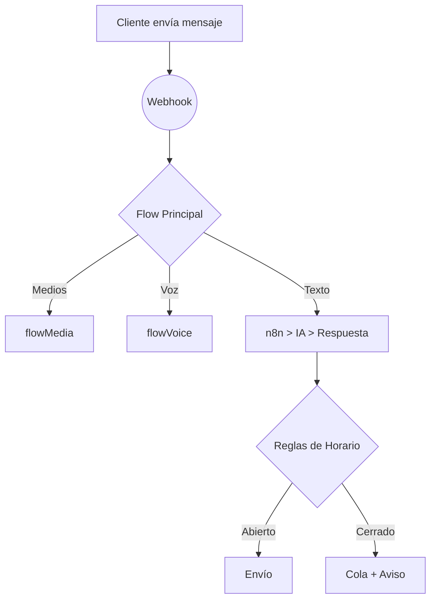

# MarIADono4

MarIADono4 — Asistente conversacional listo para usar que facilita la interacción automatizada con clientes, centrado en experiencia y resultados medibles.

## Resumen

- Proyecto: MarIADono — sistema de bots WhatsApp con múltiples proveedores y persistencia SQLite.
- Entrypoint: app.js
- DB: SQLite (src/database)
- Flujos: src/flows

## Detalle

Este repositorio agrupa la documentación y la implementación de un sistema de múltiples bots, con integración a proveedores (Baileys, BuilderBot/Meta), orquestación de flujos en `src/flows/` y persistencia en `src/database/`.

Para más información vea los documentos en `docs/` y `Documentacion/`.

<<<<<<< HEAD
# AGENTS.md - MarIADono3 WhatsApp Bot System

## Comandos
- **Iniciar bot**: `npm start` (ejecuta linting primero, luego inicia app.js)
- **Lint**: `npx eslint . --no-ignore` (se ejecuta automáticamente antes de iniciar)
- **Pre-copia**: `npm run pre-copy` (copia la librería desde el directorio padre)
- **Entrada principal**: `node app.js` (inicio directo sin linting)

---

## Arquitectura

- **Sistema de múltiples bots**: Varios bots de WhatsApp ejecutándose en diferentes puertos (6001-6015)

- **Sistema de múltiples bots**: Varios bots de WhatsApp ejecutándose en diferentes puertos (6001-6015)
- **Marco central**: @bot-whatsapp/bot con proveedor Baileys para la integración de WhatsApp
- **Base de datos**: sqlite para almacenamiento de mensajes
- **Integración de IA**: OpenAI, Ollama, LangChain para respuestas inteligentes, n8n
- **Integración de IA**: OpenAI, Ollama, LangChain para respuestas inteligentes, n8n
- **Procesamiento de mensajes**: Manejo de conversaciones basado en flujos vía src/flows/
- **Servicios**: SQLite, automatización n8n, mensajería masiva
- **Servicios**: SQLite, automatización n8n, mensajería masiva
- **Panel web**: Servidor Express con plantillas EJS en múltiples puertos

---

# Guía de Arquitectura y Componentes del Proyecto

Este documento ofrece una visión general de la estructura del proyecto y la función de cada directorio principal dentro de `src/`.

---

## 1. Punto de entrada (`../app.js`)

- **`../app.js`**: Orquesta el sistema: inicia y ejecuta múltiples instancias de WhatsApp bot, cada una en un puerto distinto.

---

## 2. Configuración (`src/config/`)

Centraliza todos los parámetros del sistema y la configuración.

- **`botConfigManager.js`**: Gestiona y carga configuraciones por bot (límites, horarios, prompts personalizados, etc.).
- **`userConfig.json`**: Gran JSON que almacena configuración y datos específicos del usuario—esencial para la personalización de la experiencia.

---

## 3. Base de Datos (`src/database/`)

Contiene toda la lógica de persistencia.  
*(Ver `DATABASE_MAINTENANCE_GUIDE.md` para detalles.)*

- **`SqliteManager.js`**: Orquestador de SQLite: maneja la conexión, modelos de tablas y sincronización de esquemas. Capa de datos central.
  - **Modelos gestionados**: ConversationsLog, ConversationMetricas, MensajeEstados, CtxLogs, ProviderLogs, Ofertas, Pedidos, Productos, Usuarios, Horarios, ReglasHorario, ExcepcionesHorario.
- **`DatabaseQueries.js`**: Capa de abstracción para consultas comunes de BD—facilita su uso desde otros módulos.
- **`models/`**: Directorio porTabla con archivos de modelos Sequelize.
- **`Data/MarIADono3DB.sqlite`**: Archivo DB SQLite que almacena todos los datos del proyecto.

---

## 4. Flujos de Conversación (`src/flows/`)

Define la lógica central de conversación del bot.

- **`flowPrincipal.js`**: Enrutador principal de mensajes entrantes, envía a los flujos relevantes.
- **`flowMedia.js`**: Maneja mensajes con medios (imágenes, videos).
- **`flowVoice.js`**: Procesa mensajes de voz, probablemente con transcripción.
- **`flowOperador.js`**: Lógica para transferir la conversación a un operador humano.

---

## 5. Lógica de Negocio e IA (`src/Logica_Workflow/`)

Inteligencia del bot e integraciones de servicios de IA.

- —

---

## 6. Automatización (`src/n8n/workflows/`)

Flujos de trabajo de n8n en JSON, que automatizan procesos invocados por el bot.

- **`Webhook_workflow (X).json`**: Flujos de trabajo principales para solicitudes del bot (clasificación de intenciones, llamadas a OpenAI, orquestación de respuestas—el "cerebro" de IA).
- **`Formateo_de_Documentos.json`**: Flujo de trabajo especializado para transformación y formateo de texto usando IA.
- **`Workflow_formattedN8nSendBulkMessages.json`**: Preprocesa y personaliza mensajes masivos antes de enviarlos.

---

## 7. Servicios (`src/services/`)

Módulos de fondo que proporcionan funciones clave.

- **`initServices.js`**: Inicia los servicios requeridos (BD, servidor web).
- **`HorarioManagerService.js`**: Administra horarios de trabajo del bot, excepciones y disponibilidad.
- **`webServerService.js`**: Inicia el servidor web (Express) que expone APIs y panel de control.

---

## 8. Mensajería Masiva (`src/bulk/`)

Lógica de mensajería masiva.

- **`bulkMessageManager.js`**: Orquesta el proceso de envío masivo.
- **`excelReader.js`**: Lee datos de mensajes/destinatarios desde archivos Excel.
- **`messageSender.js`**: Maneja el envío real de mensajes, con demoras para evitar bloqueos.

---

## 9. Utilidades (`src/utils/`)

Utilidades y herramientas para todo el proyecto.

- **`MessageData.js`**: Clase/módulo para estandarizar la estructura de datos de mensajes.
- **`messageProcessor.js`**: Orquestador principal para mensajes genéricos. Delegar lógica y generación de respuestas al webhook de n8n. Procesa la respuesta de n8n, registra métricas de embudo e interés del cliente, maneja la entrega de mensajes (respetando el horario).
- **`voiceMediaManager.js`**: Utilidades de gestión de voz/medios.
- **`chatHistoryAggregator.js`**: Acumula/formatea el historial de chat de un usuario para el contexto del modelo de IA.

---

## 10. Scripts (`src/scripts/`)

Herramientas de mantenimiento y desarrollo.

- **`createBotExcelConfig.js`**: Genera la plantilla BotConfig.xlsx para la configuración del bot.
- **`generateDbReport.js`**: Utilidad para generar informes del contenido/estado de la base de datos.

---

## 11. Interfaz Web (`src/views/`, `src/routes/`, `src/public/`)

Componentes de UI web para administración y monitoreo.

- **`views/`**: Plantillas HTML renderizadas con EJS para el panel de administración.
  - **`schedule-manager.html`**: Vista principal para la gestión de horarios del bot.
  - **`dashboard.html`**: Panel del sistema/dashboard.
- **`routes/`**: Define puntos finales REST para la interfaz web (CRUD).
  - **`scheduleRoutes.js`**: Endpoints relacionados con la creación, recuperación y eliminación de horarios.
- **`public/`**: Archivos estáticos servidos a los clientes.
  - **`js/schedule-manager.js`**: Lógica del cliente para la interfaz de gestión de horarios, haciendo llamadas a la API para cargar/guardar datos.

---

## Estilo de código

- **Módulos ES**: Usar la sintaxis require() (CommonJS)
- **Async/await**: Preferido sobre promesas para operaciones asíncronas
- **Nombres**: camelCase para variables/funciones, PascalCase para clases
- **Imports**: Desestructurar desde módulos: `const { createBot, createProvider } = require('@bot-whatsapp/bot')`
- **Manejo de errores**: Usar bloques try/catch, registrar errores en consola
- **Estructura de archivos**: Enfoque modular con archivos separados para flujos, servicios, utilidades
- **Nombres de variables**: nombres de variables, funciones, clases, etc. deben ser en español.
- **ESLint**: Usa el plugin bot-whatsapp con la configuración recomendada

---
=======
# MarIADono4
MarIADono4 — Asistente conversacional listo para usar que facilita la interacción automatizada con clientes, centrado en experiencia y resultados medibles.  Propuesta de valor: reduce el tiempo para poner en marcha un canal conversacional efectivo y coherente, mejorando la captación, el soporte y la entrega de material a los usuarios.
>>>>>>> dbde175cdd51297fa0b4f195c228cbe5a05d30c6
# MarIADono Meta

La plataforma todo-en-uno para crear, lanzar y escalar asistentes de WhatsApp impulsados por IA.

## ¿Por qué MarIADono Meta?

Las marcas pierden ventas y fidelidad cuando las respuestas tardan. MarIADono convierte WhatsApp en un canal de atención 24/7 que:

- Atiende consultas en segundos con IA generativa.
- Captura datos de clientes y los integra a tu CRM.
- Ejecuta campañas masivas sin riesgo de bloqueo.
- Habilita traspaso limpio a un operador humano cuando hace falta.

## Beneficios clave

| Beneficio | Qué significa para tu negocio |
|-----------|--------------------------------|
| Tiempo de respuesta &lt; 5 s | Clientes satisfechos y más conversiones |
| Automatización 80 %+ de consultas | Reducción de costos operativos |
| Flujos visuales n8n | Marketing y soporte sin código |
| Métricas de embudo | Decisiones basadas en datos |
| Despliegue en un clic (Docker) | Go-live en minutos |

## Funcionalidades principales

1. **Bots multinúmero** (6001-6015) — Crea varias identidades de marca en un mismo servidor.
2. **IA generativa** (OpenAI / Ollama / LangChain) — Respuestas naturales entrenadas con tu contenido.
3. **Panel web** — Dashboard, gestor de horarios y bandeja de operadores.
4. **Campañas bulk** — Importa Excel, segmenta y envía de forma segura.
5. **Automatización n8n** — Conecta con más de 300 apps sin escribir código.
6. **Observabilidad** — Logs, embudos y métricas de conversación listos para exportar.

## Casos de uso

- 🚀 Ventas asistidas: Catálogo, stock, pagos y seguimiento.
- 🛠️ Soporte técnico: FAQ dinámico + derivación a agente.
- 📢 Marketing: Difusión de novedades y cupones personalizados.
- 📅 Turnos y reservas: Agenda integrada con recordatorios automáticos.

## Tour rápido



## Primeros pasos rápidos

### 1. Con Docker (recomendado)

```bash
# Clona y crea tu .env
cp .env.example .env
# Construye y ejecuta
docker compose up -d
```

### 2. Local para desarrolladores

```bash
pnpm install
pnpm run dev # lint + nodemon
```

Accede al dashboard en `http://localhost:3000`.

## Roadmap público

- [ ] Conector Shopify
- [ ] Chatbot multilingüe con detección automática
- [ ] Estadísticas en tiempo real vía WebSocket
- [ ] Generador de flujos visual (low-code)

## Documentación técnica

Para detalles de arquitectura, estructura de carpetas y guías de contribución revisa:

- [docs/audit-summary.txt](docs/audit-summary.txt)
- [AGENTS.md](AGENTS.md)

## Comunidad y soporte

¿Preguntas? Únete al Discord de la comunidad o abre un issue.

## Licencia

MIT © Ceridono Dev
