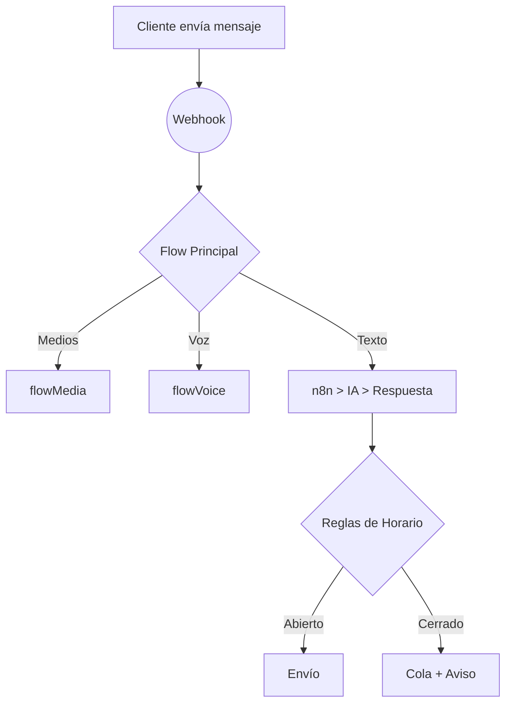

# MarIADono Meta

La plataforma todo-en-uno para crear, lanzar y escalar asistentes de WhatsApp impulsados por IA.

## ¿Por qué MarIADono Meta?

Las marcas pierden ventas y fidelidad cuando las respuestas tardan. MarIADono convierte WhatsApp en un canal de atención 24/7 que:

- Atiende consultas en segundos con IA generativa.
- Captura datos de clientes y los integra a tu CRM.
- Ejecuta campañas masivas sin riesgo de bloqueo.
- Habilita traspaso limpio a un operador humano cuando hace falta.

## Beneficios clave

| Beneficio | Qué significa para tu negocio |
|-----------|--------------------------------|
| Tiempo de respuesta &lt; 5 s | Clientes satisfechos y más conversiones |
| Automatización 80 %+ de consultas | Reducción de costos operativos |
| Flujos visuales n8n | Marketing y soporte sin código |
| Métricas de embudo | Decisiones basadas en datos |
| Despliegue en un clic (Docker) | Go-live en minutos |

## Funcionalidades principales

1. **Bots multinúmero** (6001-6015) — Crea varias identidades de marca en un mismo servidor.
2. **IA generativa** (OpenAI / Ollama / LangChain) — Respuestas naturales entrenadas con tu contenido.
3. **Panel web** — Dashboard, gestor de horarios y bandeja de operadores.
4. **Campañas bulk** — Importa Excel, segmenta y envía de forma segura.
5. **Automatización n8n** — Conecta con más de 300 apps sin escribir código.
6. **Observabilidad** — Logs, embudos y métricas de conversación listos para exportar.

## Casos de uso

- 🚀 Ventas asistidas: Catálogo, stock, pagos y seguimiento.
- 🛠️ Soporte técnico: FAQ dinámico + derivación a agente.
- 📢 Marketing: Difusión de novedades y cupones personalizados.
- 📅 Turnos y reservas: Agenda integrada con recordatorios automáticos.

## Tour rápido



## Primeros pasos rápidos

### 1. Con Docker (recomendado)

```bash
# Clona y crea tu .env
cp .env.example .env
# Construye y ejecuta
docker compose up -d
```

### 2. Local para desarrolladores

```bash
pnpm install
pnpm run dev # lint + nodemon
```

Accede al dashboard en `http://localhost:3000`.

## Roadmap público

- [ ] Conector Shopify
- [ ] Chatbot multilingüe con detección automática
- [ ] Estadísticas en tiempo real vía WebSocket
- [ ] Generador de flujos visual (low-code)

## Documentación técnica

Para detalles de arquitectura, estructura de carpetas y guías de contribución revisa:

- [docs/audit-summary.txt](docs/audit-summary.txt)
- [AGENTS.md](AGENTS.md)

## Comunidad y soporte

¿Preguntas? Únete al Discord de la comunidad o abre un issue.

## Licencia

MIT © Ceridono Dev
