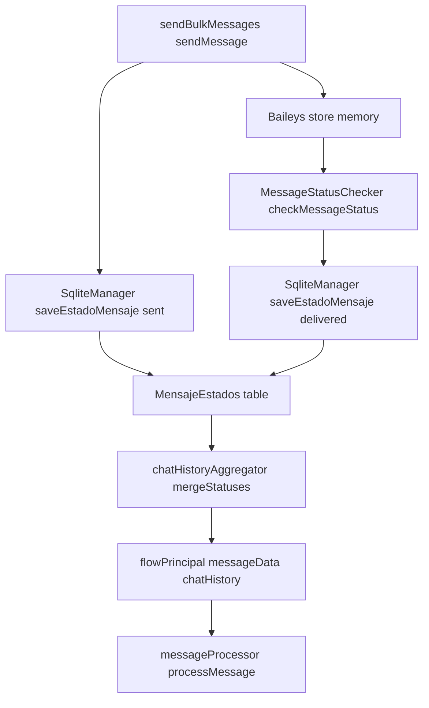

# MensajeEstados Integration Plan

## Current State
- Incoming message logging originates from [`flowPrincipal.js`](src/flows/flowPrincipal.js:89) via [`messageLogger.logMessage()`](src/utils/messageLogger.js:141).
- Outbound bulk sends are issued inside [`sendBulkMessages.js`](mensajes/sendBulkMessages.js:411) through [`sendMessage()`](mensajes/sendBulkMessages.js:202) without status persistence.
- Status polling reads provider memory within [`MessageStatusChecker.checkMessageStatus()`](src/bulk/MessageStatusChecker.js:9) yet never writes to [`MensajeEstados`](src/database/models/MensajeEstados.js:1).
- SQLite persistence helper [`SqliteManager.saveEstadoMensaje()`](src/database/SqliteManager.js:214) exists but is unused across runtime flows.

## Integration Objectives
1. Persist outbound message lifecycle events into MensajeEstados with consistent timestamps and bot context.
2. Surface delivery history to downstream processors and analytics without relying solely on volatile provider state.
3. Provide reconciliation capabilities for bulk operations and message health monitoring.

## Work Packages
1. **Enhance outbound send pipeline**
   - Extend [`sendMessage()`](mensajes/sendBulkMessages.js:202) to capture provider responses and persist { messageId, estado: 'sent', botName, remoteJid, timestamp }.
   - Acquire a shared manager via [`SqliteManager.getInstance()`](src/database/SqliteManager.js:22) once per bulk session to avoid repeated initialization.
   - Propagate stored messageId back into [`MessageData`](src/utils/MessageData.js:11) instances before invoking [`logMessage()`](mensajes/sendBulkMessages.js:398).

2. **Persist provider status callbacks**
   - Register a Baileys event listener (e.g., messages.update) during bot bootstrap in [`flowPrincipal.js`](src/flows/flowPrincipal.js:42) or provider init utilities.
  - Normalize updates into { messageId, estado, timestamp, botName } and save through [`SqliteManager.saveEstadoMensaje()`](src/database/SqliteManager.js:214).
   - Handle missing messageId gracefully by logging and skipping persistence.

3. **Enrich chat history aggregation**
   - Fetch recent states from MensajeEstados and merge inside [`chatHistoryAggregator`](src/utils/chatHistoryAggregator.js:7) before composing history strings.
   - Extend [`MessageData`](src/utils/MessageData.js:11) with a statusHistory array to expose persisted states to downstream processors.

4. **Refine status analytics**
   - Update [`MessageStatusChecker.getAllMessageStatusesHoy()`](src/bulk/MessageStatusChecker.js:44) to query MensajeEstados first and fall back to provider memory only when needed.
   - Add database helpers in [`DatabaseQueries`](src/database/DatabaseQueries.js:7) for filtering by botName, date range, and estado.

5. **Testing and migration prep**
   - Create seed scenarios that send sample bulk messages, trigger simulated status updates, and verify persistence using [`SqliteManager.saveEstadoMensaje()`](src/database/SqliteManager.js:214).
   - Outline cleanup or archival policy to prune stale records (e.g., nightly job removing entries older than 30 days).

## Data Flow Overview

## Verification & Safeguards
- Ensure SQLite writes are wrapped in try/catch with diagnostic logs to avoid breaking message flows.
- Batch database calls where possible and reuse initialized managers to minimize overhead.
- Document manual verification steps (SQLite queries, provider store inspection) for operations runbooks.
- Schedule follow-up work to expose MensajeEstados metrics on dashboards or admin reports once data is populated.