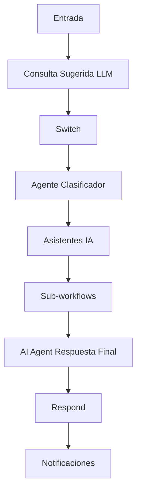

# Plan de Implementación para Webhook_workflow.md

Este documento describe el plan de implementación para el flujo Webhook_workflow que orquesta clasificación y generación de respuestas con IA, alineado con la arquitectura existente en src/flows y src/Logica_Workflow. Incluye un diagrama de alto nivel, contratos de datos, y pasos de implementación por fases.

## Diagrama de alto nivel

Notas:
- El diagrama representa el flujo de datos y las decisiones principales entre nodos.
- Se debe mantener la consistencia de nombres de nodos con la estructura existente en src/flows y src/Logica_Workflow.

## Objetivo y alcance
- Alinear la documentación con la arquitectura actual (nodos de flujo, sub-workflows, asistentes IA, etapas del embudo).
- Definir entradas y salidas, prompts base y formatos estructurados para facilitar futuras implementaciones.
- Proporcionar un plan de implementación por fases con entregables claros.

## Plan de fases
- Fase 1 Definición de contratos de entrada/salida
- Especificar campos clave de entrada (MessageData.body, MessageData._chatHistory, metadata) y salidas esperadas de cada nodo.
- Fase 2 Plantillas de prompts por nodo
- Definir prompts skeleton para Consulta Sugerida LLM, Agente Clasificador, Question/Clarificación y Asistentes IA.
- Fase 3 Formato de salida y parsers
- Establecer estructura JSON de salida y parsers estructurados (Structured Output Parser).
- Fase 4 Mapeo a código existente
- Alinear nombres de nodos con src/flows y src/Logica_Workflow; actualizar referencias si es necesario.
- Fase 5 Sub-workflows e interacción
- Documentar sub-workflows (Call_Sub_Workflow_Sucursal, Call_Sub_Workflow_Cursos, Call_Sub_Workflow_Productos, Notificaciones_SubWorkflow) y dependencias de datos.
- Fase 6 Seguridad y cumplimiento
- Gestión de credenciales y reglas de manejo de datos sensibles.
- Fase 7 Pruebas y validación
- Definir casos de prueba y criterios de aceptación.
- Fase 8 Mantenimiento y extensibilidad
- Procedimientos para añadir nuevos asistentes y flujos.

## Contratos de datos (ejemplo)
- Entrada: MessageData.body, MessageData._chatHistory, metadatos relevantes
- Salida: JSON estructurado con los campos de salida

## Estructura de salida (ejemplo)
- consultaReformulada: string
- confianza: number
- categoria: string
- rutaAsistente: string
- informacionAsistente: object
- respuestaFinal: string
- interesCliente: string[]
- etapaEmbudo: integer
- notificacionEstado: boolean
- rawOutputs: any[]

## Consideraciones de implementación
- Mantener nombres de nodos consistentes con la codebase
- Definir prompts y mapeos inputs/outputs
- Verificar parsers estructurados

## Anexos
- Plantillas de prompts (indicativas)
- Ejemplos de salidas estructuradas
- Esquemas de inputs/outputs entre nodos