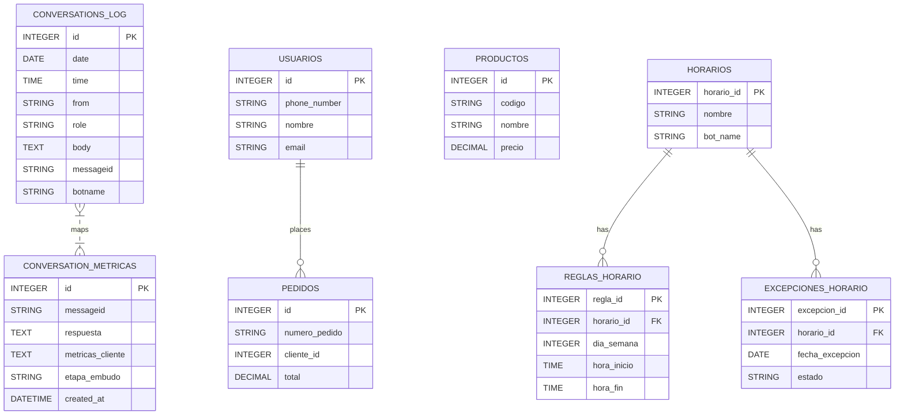

# Informe técnico: Base de datos — MarIADono (SQLite + Sequelize)

**Generado:** 2025-12-28

---

## 1. Resumen ejecutivo

- Motor: SQLite (archivo local) administrado por `Sequelize`.
- Archivo de datos principal: `src/database/Data/MarIADono3DB.sqlite` (la ruta precisa se resuelve en `SqliteManager`). Ver inicialización en [src/database/SqliteManager.js](src/database/SqliteManager.js#L1).
- Propósito: almacenamiento de logs de conversación, métricas, contexto, provider logs, sistema de horarios polimórfico y datos básicos de e‑commerce (usuarios, productos, pedidos, ofertas).

---

## 2. Localización y artefactos clave

- Orquestador / inicialización: [src/database/SqliteManager.js](src/database/SqliteManager.js#L1)
- Consultas y helpers: [src/database/DatabaseQueries.js](src/database/DatabaseQueries.js#L1) y [src/database/scripts/](src/database/scripts/)
- Modelos Sequelize: [src/database/models](src/database/models/index.js#L1)
- Informes y generadores: [src/database/Informes](src/database/Informes/generateWeeklyConversationLogReport.js#L1)
- Archivo físico de datos: `src/database/Data/MarIADono3DB.sqlite` (candidato principal, ver resolución en `SqliteManager`).

---

## 3. Inventario de tablas (esquema) — resumen por tabla

- `ConversationsLog` (conversations_log)
  - Campos: `id`, `date`, `time`, `from`, `role`, `pushName` (`pushname`), `body`, `messageId` (`messageid`), `etapaEmbudo`, `interesCliente`, `botName`.
  - Uso: registro cronológico de mensajes entrantes y salientes.
  - Modelo: [src/database/models/ConversationsLog.js](src/database/models/ConversationsLog.js#L1)

- `ConversationMetricas` (conversation_metricas)
  - Campos: `id`, `messageId`, `respuesta`, `metricasCliente`, `interesCliente`, `estadoHabilitacionNotificacion`, `etapaEmbudo`, `consultaReformulada`, `confianzaReformulada`, `asistenteInformacion`, `created_at`.
  - Uso: métricas y metadatos sobre interacciones.
  - Modelo: [src/database/models/ConversationMetricas.js](src/database/models/ConversationMetricas.js#L1)

- `MensajeEstados` (mensaje_estados)
  - Campos: `id`, `messageId`, `estado`, `timestamp`, `created_at`.
  - Uso: estados de entrega/lectura de mensajes.
  - Modelo: [src/database/models/MensajeEstados.js](src/database/models/MensajeEstados.js#L1)

- `CtxLogs` (ctx_logs)
  - Campos: `id`, `phoneNumber`, `contextData` (JSON), `timestamp`, `created_at`.
  - Uso: persistencia de contexto conversacional por usuario.
  - Modelo: [src/database/models/CtxLogs.js](src/database/models/CtxLogs.js#L1)

- `ProviderLogs` (provider_logs)
  - Campos: `id`, `phoneNumber`, `providerName`, `action`, `data` (JSON), `timestamp`, `created_at`.
  - Uso: auditoría de llamadas/acciones con proveedores (Meta, APIs externas).
  - Modelo: [src/database/models/ProviderLogs.js](src/database/models/ProviderLogs.js#L1)

- `N8nMetric` (n8n_metrics)
  - Campos: `id`, `userId`, `botName`, `messageId`, `interesCliente`, `etapaEmbudo`, `estadoHabilitacionNotificacion`, `consultaReformulada`, `confianzaReformulada`, `asistenteInformacion`, `respuestaFinal`, timestamps.
  - Uso: métricas enriquecidas de flujo/automatización.
  - Modelo: [src/database/models/N8nMetric.js](src/database/models/N8nMetric.js#L1)

- `Usuarios` (usuarios)
  - Campos: `id`, `phoneNumber`, `nombre`, `email`, `fechaRegistro`, `activo`, `created_at`.
  - Uso: registro de clientes/usuarios.
  - Modelo: [src/database/models/Usuarios.js](src/database/models/Usuarios.js#L1)

- `Productos` (productos)
  - Campos: `id`, `codigo`, `nombre`, `descripcion`, `precio`, `stock`, `categoria`, `created_at`.
  - Uso: catálogo de productos.
  - Modelo: [src/database/models/Productos.js](src/database/models/Productos.js#L1)

- `Pedidos` (pedidos)
  - Campos: `id`, `numeroPedido`, `clienteId`, `fechaPedido`, `total`, `estado`, `created_at`.
  - Uso: registro de pedidos.
  - Modelo: [src/database/models/Pedidos.js](src/database/models/Pedidos.js#L1)

- `Ofertas` (ofertas)
  - Campos: `id`, `codigo`, `descripcion`, `precio`, `fechaOferta`, `created_at`.
  - Uso: promociones/ofertas.
  - Modelo: [src/database/models/Ofertas.js](src/database/models/Ofertas.js#L1)

- Sistema de horarios (polimórfico)
  - `Horarios` (horarios): `horarioId`, `nombre`, `descripcion`, `botName`, `tipoHorario_id`, `zonaHoraria`, `activo`, timestamps. ([src/database/models/Horarios.js](src/database/models/Horarios.js#L1))
  - `ReglasHorario` (reglas_horario): `reglaId`, `horarioId`, `diaSemana`, `horaInicio`, `horaFin`, `activo`. ([src/database/models/ReglasHorario.js](src/database/models/ReglasHorario.js#L1))
  - `ExcepcionesHorario` (excepciones_horario): `excepcionId`, `horarioId`, `fechaExcepcion`, `estado`, `horaInicio`, `horaFin`, `descripcion`. ([src/database/models/ExcepcionesHorario.js](src/database/models/ExcepcionesHorario.js#L1))

---

## 4. Relaciones y reglas de integridad

- Asociaciones definidas (actualmente activas para horarios):
  - `Horarios.hasMany(ReglasHorario, { foreignKey: 'horario_id', as: 'reglas' })`
  - `Horarios.hasMany(ExcepcionesHorario, { foreignKey: 'horario_id', as: 'excepciones' })`
  - `ReglasHorario.belongsTo(Horarios, { foreignKey: 'horario_id', as: 'horario' })`
  - `ExcepcionesHorario.belongsTo(Horarios, { foreignKey: 'horario_id', as: 'horario' })`
- Otras FK no están forzadas en código para evitar problemas con SQLite; `SqliteManager` comenta esta decisión y evita asociaciones más agresivas. (ver [src/database/SqliteManager.js](src/database/SqliteManager.js#L1))
- `Usuarios.phoneNumber` tiene restricción `unique`.

---

## 5. Diagrama ER (mermaid)



> Nota: el diagrama es de alto nivel. Para un ER detallado (FK explícitas/índices) se recomienda generar con una herramienta que lea la base (DB Browser for SQLite, DBeaver) o exportar esquema via script.

---

## 6. Consultas útiles (ejemplos)

- Conteo diario por bot:

```sql
SELECT date, botname, COUNT(*) AS mensajes
FROM conversations_log
GROUP BY date, botname
ORDER BY date DESC;
```

- Conversaciones recientes por teléfono:

```sql
SELECT * FROM conversations_log
WHERE "from" = '<telefono>'
ORDER BY date DESC, time DESC
LIMIT 50;
```

- Métricas por etapa del embudo:

```sql
SELECT etapa_embudo, COUNT(*)
FROM conversation_metricas
GROUP BY etapa_embudo;
```

---

## 7. Recomendaciones operativas y de mejora

1. Backups y retención
   - Automatizar backups del archivo `MarIADono3DB.sqlite` (copias diarias + retención semanal/mensual). Usar cron o tarea programada en Windows (PowerShell).
2. Migración a RDBMS servidor
   - Si la concurrencia o el tamaño crece, migrar a Postgres/MySQL para mejor concurrencia y gestión de índices.
3. Índices
   - Añadir índices en campos de consulta frecuente: `conversations_log.from`, `conversations_log.messageid`, `conversations_log.botname`, `conversation_metricas.messageid`.
4. Migraciones
   - Integrar `sequelize-cli` y versionar migraciones en `migrations/` para cambios controlados de esquema.
5. Retención y purga
   - Implementar políticas de retención (ej.: purga de `provider_logs` y `ctx_logs` mayores a X meses) y archivado a formatos CSV/Parquet para análisis histórico.
6. Integridad y FK
   - Evaluar activar `PRAGMA foreign_keys = ON` y reforzar FK en modelos si se migra a servidor; actualmente SQLite evita relaciones fuertes por compatibilidad.
7. Monitorización
   - Exponer métricas de uso (tasa de inserciones, tamaño del archivo DB) y alertas cuando el archivo supere umbrales.
8. Seguridad
   - No versionar el archivo SQLite; asegurar backups en almacenamiento seguro. Externalizar ruta con `SQLITE_DB_PATH` (ya soportado).

---

## 8. Tareas recomendadas y plan de acción (priorizadas)

- Corto plazo (1-2 semanas):
  - Implementar backup automático del archivo SQLite.
  - Añadir índices en columnas de búsqueda frecuente.
  - Ejecutar analítica para identificar tablas que más crecen.

- Medio plazo (1-3 meses):
  - Añadir `sequelize-cli` y escribir migraciones para esquema actual.
  - Definir políticas de retención y purga.

- Largo plazo (3-6 meses):
  - Plan de migración a Postgres (exportar datos, adaptar `config` y `SqliteManager`).
  - Integrar pipeline de observabilidad y alertas.

---

## 9. Recursos y referencias (código)

- Inicialización y modelos: [src/database/SqliteManager.js](src/database/SqliteManager.js#L1) y [src/database/models/](src/database/models/index.js#L1)
- Scripts y generadores de informes: [src/database/Informes](src/database/Informes/generateWeeklyConversationLogReport.js#L1)
- Helpers y consultas: [src/database/DatabaseQueries.js](src/database/DatabaseQueries.js#L1)

---

Si quieres, genero:
- Un PDF exportable de este Markdown.
- Un script PowerShell/Node para backups automáticos.
- Migración inicial (export SQL + ejemplo `config` para Postgres).

Fin del informe.
